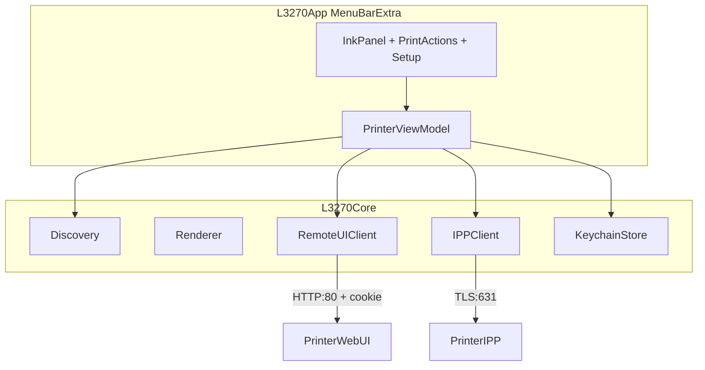

# L3270 macOS Menu Bar App — Completion Plan

## Where we are

**Phase 1 is done and verified** ([session-ses_fd00.md](session-ses_fd00.md)):

| Module | Status |
|--------|--------|
| [swift/Sources/L3270Core/Raster.swift](swift/Sources/L3270Core/Raster.swift) | PWG headers + PackBits (byte-parity with Python) |
| [swift/Sources/L3270Core/Renderer.swift](swift/Sources/L3270Core/Renderer.swift) | CoreGraphics render (color channel fix verified) |
| [swift/Sources/L3270Core/IPP.swift](swift/Sources/L3270Core/IPP.swift) + [HTTP.swift](swift/Sources/L3270Core/HTTP.swift) | Implicit-TLS IPP Print-Job |
| [swift/Sources/L3270Core/Discovery.swift](swift/Sources/L3270Core/Discovery.swift) | Bonjour browse + resolve |
| [swift/Sources/l3270/main.swift](swift/Sources/l3270/main.swift) | CLI (live print confirmed) |

**21/21 tests pass.** Live print works with correct colors.

**Phase 2 started but stalled.** Auth is mapped; ink parsing hit a dead end because the session inspected empty `tank_3rd` divs. Community integrations (e.g. [ha-epson-ecotank-stats](https://github.com/wwerther/ha-epson-ecotank-stats)) show the real signal is `` bar heights on the status page, not the empty tank shells.

---

## Architecture (target state)



Two separate transports, same discovered host:

- **IPP** (port 631, implicit TLS) — printing; reuse existing [HTTP.swift](swift/Sources/L3270Core/HTTP.swift)
- **Remote UI** (port 80, plain HTTP, session cookie) — ink levels + printer status; new client

---

## Phase 2A — Resolve ink data (spike first, ~1 hour)

Before writing parser code, capture real HTML from your L3270 with the known auth flow:

1. **Login** (already confirmed in session):
   - `POST /PRESENTATION/PSWD` body: `session=<password>&from=top&trigger=set&access=https`
   - Capture cookie: `EPSON_COOKIE_SESSION=session&<uuid>`

2. **Fetch status pages** with cookie (try in order until ink `` bars appear):
   - `/PRESENTATION/HTML/TOP/PRTINFO.HTML` (session tried this — may need authenticated re-fetch)
   - `/PRESENTATION/ADVANCED/INFO_PRTINFO/TOP` (used by EcoTank HA integrations)
   - Optionally POST `SEL_LANGA=1` once to force English labels

3. **Expected ink format** (from EcoTank community scrapers):
   - `` (and C/M/Y/Waste)
   - Percentage = `height / FULL_TANK_PX * 100` (CSS tank height ≈ 50px; calibrate from live page)

4. **Save captured HTML** to `swift/Tests/Fixtures/prtinfo-authenticated.html` for offline tests.

**Exit criteria:** We can read K/C/M/Y percentages from fixture HTML with a standalone parser test.

> If no `` bars exist on this firmware (unlikely for L3270), fallback UI shows "Check tanks visually" + printer state text from the same page — do not block the app on perfect percentages.

---

## Phase 2B — Remote UI client in L3270Core

### New files

| File | Responsibility |
|------|----------------|
| `swift/Sources/L3270Core/RemoteHTTP.swift` | Plain HTTP GET/POST on port 80; cookie jar; header/body split (extract shared logic from [HTTP.swift](swift/Sources/L3270Core/HTTP.swift)) |
| `swift/Sources/L3270Core/RemoteUIClient.swift` | Login, session refresh, fetch status, return structured `PrinterStatus` |
| `swift/Sources/L3270Core/KeychainStore.swift` | Store/retrieve admin password keyed by printer host or Bonjour name |
| `swift/Tests/L3270Tests/RemoteUITests.swift` | Parser tests against fixture HTML |

### Core types

```swift
public struct InkLevels: Equatable {
    public let black, cyan, magenta, yellow: Int?  // 0–100, nil = unknown
    public let waste: Int?
}

public struct PrinterStatus: Equatable {
    public let state: String          // e.g. "Available", "Printing"
    public let ink: InkLevels
    public let firmware: String?
}

public enum RemoteUIError: Error {
    case authFailed
    case sessionExpired
    case parseFailed
    case connectionFailed(String)
}
```

### Refactor [HTTP.swift](swift/Sources/L3270Core/HTTP.swift)

Extract shared `send/receive/splitHTTP/dechunk` into an internal helper; keep TLS path for IPP, add plain-TCP path for Remote UI. Add per-address connect deadline (session found 180s hangs when IPv6 stalls — fix now while touching HTTP).

### Password policy

- **No brute-force / cracking** — initial password is on the printer label (Epson requirement since 2017); app asks once, stores in Keychain.
- Guided first-run sheet: "Find the password on the label attached to your printer."

---

## Phase 2C — Menu bar app skeleton

### Package changes ([swift/Package.swift](swift/Package.swift))

Add executable target `L3270App` (SwiftUI, macOS 13+):

```swift
.executableTarget(
    name: "L3270App",
    dependencies: ["L3270Core"],
    path: "Sources/L3270App"
)
```

Keep `debugtool` for dev; exclude from release/docs.

### App structure

```
swift/Sources/L3270App/
  L3270App.swift          @main, MenuBarExtra("L3270", systemImage: "printer.fill")
  PrinterViewModel.swift  @MainActor observable state
  InkPanelView.swift      C/M/Y/K gauge bars + printer name + last-updated
  SetupView.swift         Password entry + "find label" help text
  SettingsView.swift      Printer picker, poll interval, mono default
  PrintCoordinator.swift  Wraps Renderer + IPPClient (shared with CLI logic)
```

### ViewModel behavior

- On launch: `Discovery.findPrinters(matching: "L3270")` → pick first (or remembered)
- If no Keychain password → show Setup sheet
- Poll ink every 60s while app runs; refresh immediately when menu opens
- Surface errors inline ("Incorrect password", "Printer unreachable")

### Menu bar UX (v1)

- **Popover:** 4 colored ink bars + status line + "Refresh"
- **Menu items:** Print File…, Settings…, Quit
- **Low-ink alert:** `UNUserNotificationCenter` when any tank drops below 15% (once per tank until refilled)

---

## Phase 3 — Print from menu bar

Reuse the proven CLI pipeline inside `PrintCoordinator`:

1. `NSOpenPanel` for PDF/image (UTTypes: `.pdf`, `.jpeg`, `.png`, `.heic`, `.tiff`)
2. Render via `Renderer.renderFile` + `writePWGRaster`
3. Send via `IPPClient.printJob` to discovered/saved printer
4. Show progress + result in popover ("Job 12 accepted")

Optional polish (same phase, low cost):

- Default media from Settings (A4)
- Mono toggle in print sheet
- Drag-and-drop onto menu bar icon → print with defaults

No new protocol code — only UI wiring.

---

## Phase 4 — Ship it

### Build & distribution

- Add `swift/` targets to [Makefile](Makefile): `make swift-test`, `make swift-build`, `make swift-run`
- Create minimal Xcode project (or open Package in Xcode) to produce signed **`L3270.app`** menu bar agent (`LSUIElement = true`, no Dock icon)
- Update [README.md](README.md): Swift path as primary, Python as reference; menu bar app usage

### Test matrix

| Layer | Tests |
|-------|-------|
| Raster/Renderer/IPP | Existing 21 tests (keep green) |
| RemoteUI parser | New fixture-based tests |
| Integration | Manual: ink poll + print test page from menu |

### Cleanup

- Gate `debugtool` behind `#if DEBUG` or document as dev-only
- Do not commit printer passwords or live HTML with serial numbers in fixtures (sanitize)

---

## Implementation order (recommended)

1. **Spike ink HTML** on live printer → save fixture → confirm img-height parsing
2. **RemoteHTTP + RemoteUIClient + tests** (core, no UI yet)
3. **KeychainStore**
4. **L3270App skeleton** — discovery + ink panel + password setup
5. **PrintCoordinator** — print from menu
6. **Notifications + Settings polish**
7. **Makefile, README, .app bundle**

Each step is independently testable; steps 1–3 unblock everything else.

---

## Risks and mitigations

| Risk | Mitigation |
|------|------------|
| L3270 firmware uses different HTML than ET-series | Spike first; try ADVANCED endpoint; fixture-driven parser with fallbacks |
| EcoTank reports coarse levels only | Show bar + "approximate" label; still useful vs nothing |
| IPv6 link-local hangs | Already partially fixed; add connect deadline in HTTP refactor |
| Remote UI session expires | Re-login transparently on 401/redirect-to-PSWD |
| Menu bar app needs .app bundle for daily use | Phase 4 Xcode wrapper; `swift run L3270App` works for dev |

---

## Definition of done

- Menu bar app discovers L3270, stores label password in Keychain
- Ink panel shows K/C/M/Y levels refreshed from Remote UI
- Low-ink notification fires below threshold
- "Print File…" sends a PDF/image with correct colors (same pipeline as CLI)
- All Swift tests pass; README documents install + usage
- Build produces `L3270.app` ready for local install
